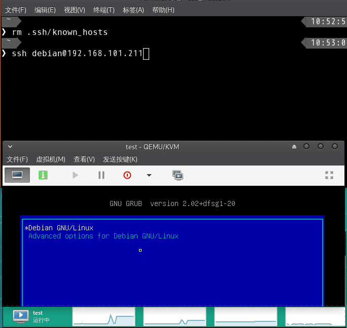

[English](README.md) ←
# 基于Debian 10环境的OpenWrt镜像刷写脚本

使用虚拟机搭建软路由者可略过本文档说明，使用本人仓库中的脚本反而更加复杂。

## 什么样的情况需要使用本脚本 ?

- 不想使用rootfs-squashfs格式的系统镜像将硬盘全盘刷写,避免磁盘空间的浪费
- 使用rootfs-ext4来避免rootfs-suqshfs格式镜像无法扩展分区容量的情况
- 避免升级系统的时候，需要额外挂载磁盘来进行维护的情况
- 确保上述条件下，快速搭建实体软路由系统

## 依赖

- Debian 10 Linux发行版
- parted 分区工具
- e2fsck
- resize2fs
- update-grub2 引导启动器
- OpenWrt-x86-64-rootfs-ext4.img 根目录文件镜像
- OpenWrt-x86-64-vmlinuz 内核文件
- Linux发行版安装经验
- Linux系统分区知识

## 功能

- 在Debian发行版环境下，刷写OpenWrt 固件到指定分区，并扩展OpenWrt的根分区
- 在OpenWrt/Debian双系统的情况下，变更系统启动顺序，使OpenWrt为默认启动系统
- 使用备份文件恢复OpenWrt配置
- 使用最新的镜像及系统内核文件升级OpenWrt固件

## 用法：

### 纯命令行脚本
1. 给磁盘分区并格式化
    - 划分四个分区(MBR): 
        swap交换分区 boot(ext2)启动文件分区 root(ext4 being used to mount Debian / directory)Debian系统根分区 
    - 剩余的磁盘空间用于烧写、挂载OpenWrt根分区(ext4)
2. 安装Debian 10 发行版到磁盘中
3. 复制本仓库目录，并在目录中包含OpenWrt-x86-64-rootfs-ext4.img.gz 、 OpenWrt-x86-64-vmlinuz和 OpenWrt 配置备份文件到Debian发行版所在磁盘目录(使用ssh登录机器进行操作)
4. 执行openwrt_grub_config.sh脚本 :
    - 完整配置:

        ```sh
        ./openwrt_grub_config.sh -m
        ```

    - 升级OpenWrt:

        ```sh
        ./openwrt_grub_config.sh -u
        ```

    - 恢复OpenWrt配置:

        ```sh
        ./openwrt_grub_config.sh -r
        ```

    - 调整OpenWrt分区大小:

        ```sh
        ./openwrt_grub_config.sh -s
        ```
    - 重启计算机:
    
        ```sh
        reboot
        ```


### 带UI脚本，基于dialog

  执行  `./openwrt_grub_config.sh`

## 操作动画:


