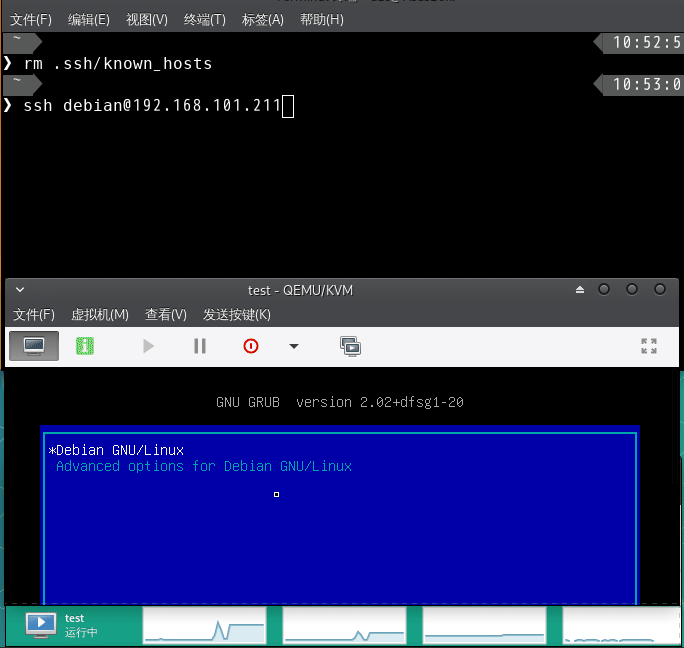

[中文](README-CN.md) ←
# OpenWrt-Debian-Grub
The script in the Repository is used to build Openwrt root partition and boot it or Debian . Then we can update OpenWrt by using rootfs-ext4.img and vmlinuz kernel on Debian/GNU system. 

## Dependencies

- Debian 10
- parted 
- update-grub2
- OpenWrt-x86-64-rootfs-ext4.img
- OpenWrt-x86-64-vmlinuz

## Features

- Write OpenWrt root ext4 partition to disk on Debian 10
- Change boot order
- Recovery OpenWrt configuration files by using backup file
- Upgrade OpenWrt by using the latest image and vmlinux kernel file

## Usage:

1. Part and format your disk.
    - part 4 partition(MBR): 
        swap boot(ext2) root(ext4 being used to mount Debian / directory) 
    - the left partition being used to mount and write OpenWrt(ext4)
2. Install Debian 10 to your disk.
3. Copy the directory that included OpenWrt-x86-64-rootfs-ext4.img.gz , OpenWrt-x86-64-vmlinuz and your OpenWrt configuration backup file in the repository to the disk on Debian that have been installed just now.
4. Execute openwrt_grub_config.sh :
    - fully configure:

        ```sh
        ./openwrt_grub_config.sh -m
        ```

    - upgrade OpenWrt:

        ```sh
        ./openwrt_grub_config.sh -u
        ```

    - recover configuartion:

        ```sh
        ./openwrt_grub_config.sh -r
        ```

5. resize openwrt partition:

        ```
        parted /dev/sda
        p
        redizepart PARTNUM END
        quit
        ```

6. reboot computer
    
        ```
        reboot
        ```

## Operation Gif:

